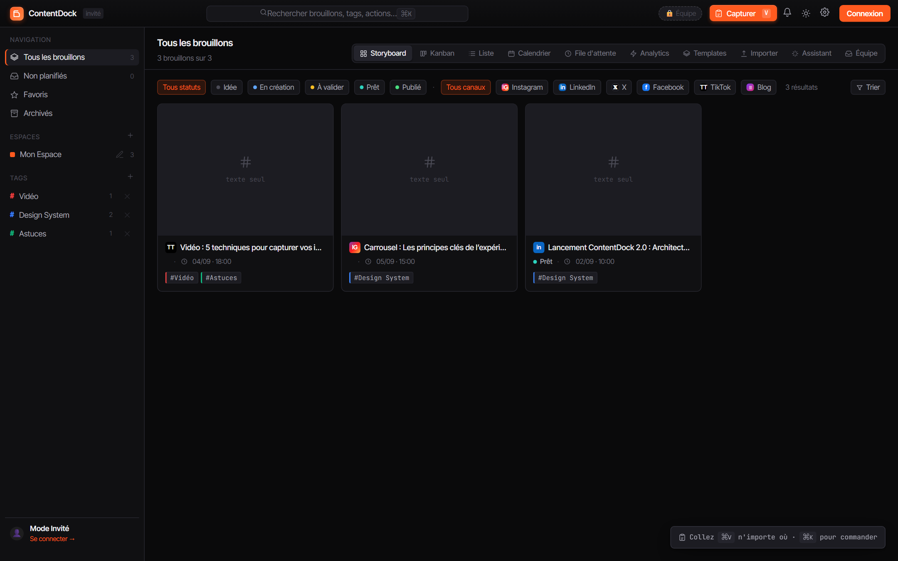
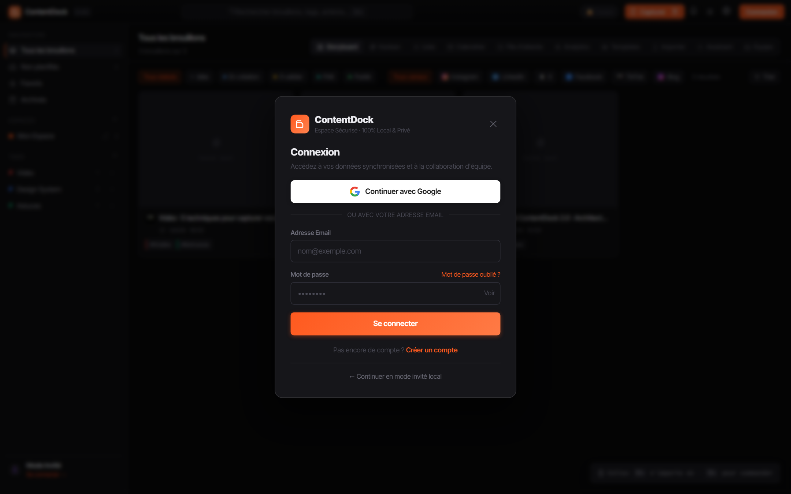
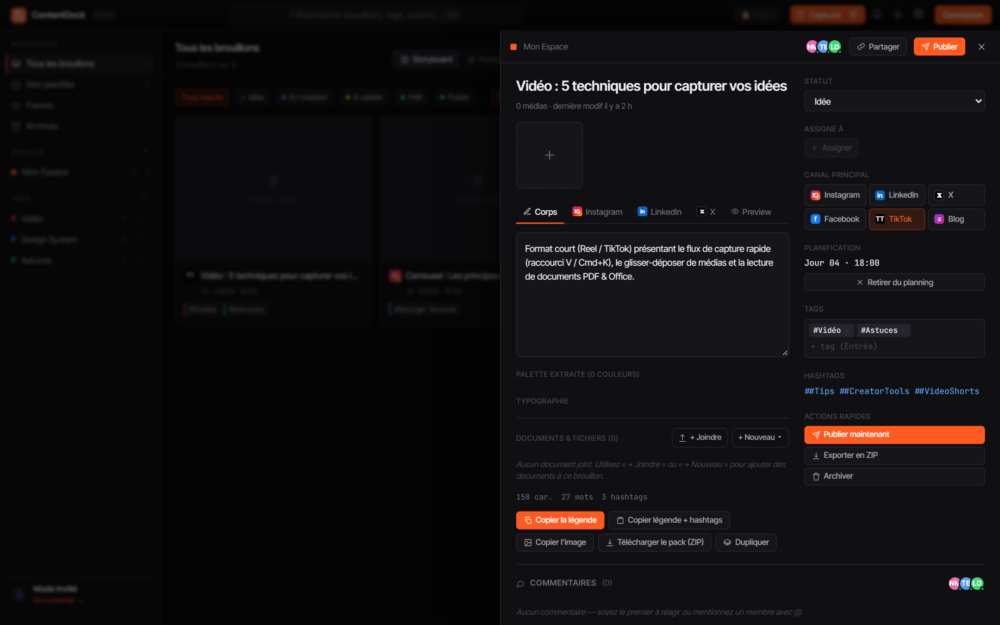
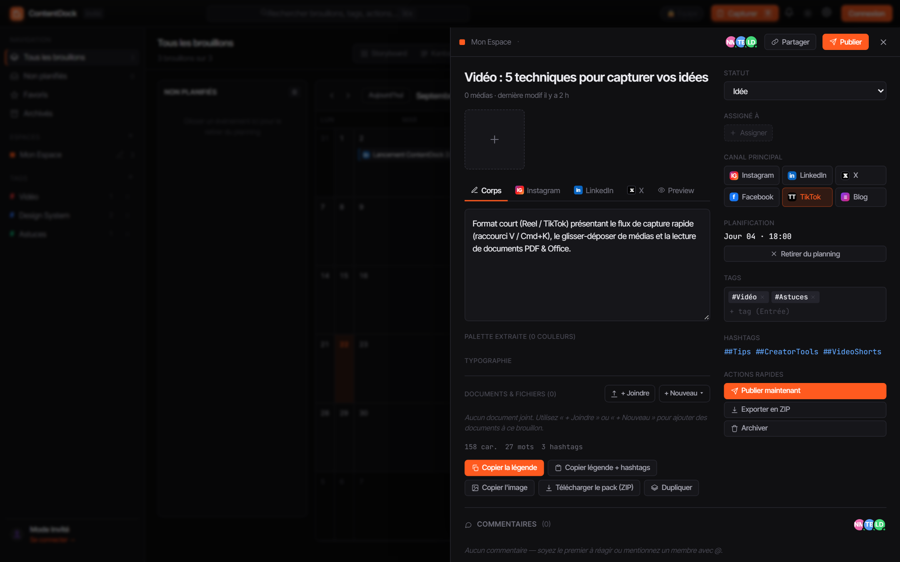
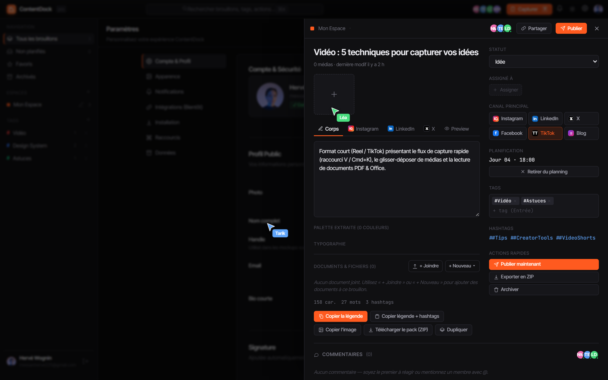
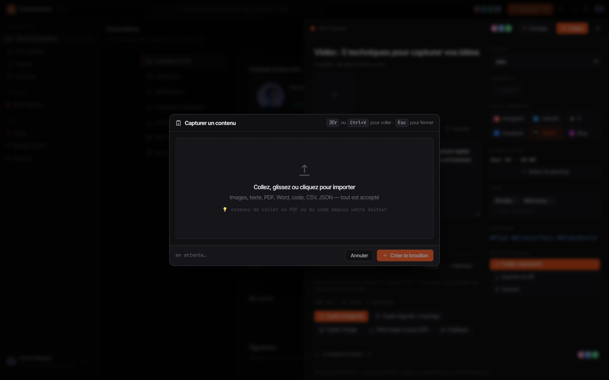

# 🚀 ContentDock

<div align="center">



**Plateforme autonome et souveraine de capture, planification et publication de contenus.**  
*100% Offline-First · Base SQLite locale · Desktop Windows & Mobile Android · Collaboration sécurisée*

[](https://github.com/herve4/ContentDock)
[](https://github.com/herve4/ContentDock)
[](https://github.com/herve4/ContentDock)
[](https://github.com/herve4/ContentDock)
[](https://github.com/herve4/ContentDock)

</div>

---

## 📸 Galerie d'Aperçus (Screenshots)

### 1. Dashboard Principal & Storyboard
> Organisez vos idées sous forme de cartes visuelles interactives avec filtres multi-canaux (LinkedIn, Instagram, TikTok, X, Facebook, Blog) et tags thématiques colorés.


---

### 2. Inscription & Connexion par Google
> Authentification moderne en un clic via **Google Identity Services** (GIS) ou création de compte autonome local avec validation par code OTP via serveur SMTP.



---

### 3. Fiche Brouillon & Prévisualisation Multi-Plateformes
> Rédigez vos légendes, extrayez palettes et typographies, prévisualisez le rendu exact par réseau social, et gérez vos documents joints avec export ZIP instantané.



---

### 4. Calendrier Éditorial & Programmation
> Planifiez vos publications par glisser-déposer sur une vue mensuelle ou hebdomadaire. ContentDock gère les rappels système automatiques en tâche de fond.



---

### 5. Profil & Réglages Synchronisés
> Visualisez votre statut de session (compte Google ou SQLite local vérifié), gérez les notifications natives système bureau/mobile et personnalisez votre profil créateur.



---

### 6. Capture Rapide Universelle (`V` / `⌘K`)
> Capturez instantanément n'importe quel contenu par raccourci clavier : textes, images, vidéos, feuilles Excel, documents Word ou PDF.



---

## ✨ Fonctionnalités Majeures

### 🔒 100% Offline-First & Données Souveraines
- Moteur relationnel **SQLite embarqué** (WebAssembly + IndexedDB persistant).
- Vos données ne quittent jamais votre machine sans votre consentement explicite.
- Zéro temps de latence au démarrage et fonctionnement garanti sans connexion Internet.

### 🔑 Double Authentification (Google Sign-In & OTP)
- **Continuer avec Google** : Connexion transparente avec synchronisation SQLite locale, récupération de photo de profil et badge vérifié.
- **Compte local sécurisé** : Validation OTP à 6 chiffres via serveur SMTP Gmail pour les invitations et réinitialisations de mot de passe.
- **Mode Invité par défaut (Guest-First)** : Utilisez immédiatement l'application sans créer de compte obligatoire.

### 📄 Moteur Universel de Documents & Médias
- **Excel & Tableurs (`.xlsx`, `.csv`)** : Extraction tabulaire 2D haute fidélité avec visionneuse, barre de cellule `fx:`, et mode édition interactif (ajout de lignes/colonnes, modification de cellules et export).
- **Word (`.docx`)** : Décompression OpenXML native et rendu document textuel propre avec outils d'édition.
- **PowerPoint (`.pptx`)** : Visionneuse de diaporama au ratio 16:9 avec miniatures et mode diapositives.
- **PDF (`.pdf`)** : Visionneuse intégrée haute résolution avec extraction de texte et volet d'annotations.
- **Vidéos & Images** : Lightbox interactive plein écran, boucle vidéo, et remplacement de média sans rechargement.

### 🏷️ Gestion Avancée des Tags & Espaces
- Création et suppression dynamique de tags colorés (`#Marketing`, `#Design`, `#Vidéo`...).
- Nettoyage en cascade automatique dans les brouillons lors de la suppression d'un tag.
- Espaces de travail personnalisables pour séparer projets personnels et collaborations d'équipe.

### ⏰ Notifications Natives & Tâche de Fond
- **Bureau Windows** : Notifications système natives pour les rappels de publication.
- **Téléphone Android** : Notifications locales natives via Capacitor.
- Surveillance automatique en tâche de fond (rappel 1 heure avant et à l'heure exacte).

---

## 🛠️ Pile Technologique

| Composant | Technologie |
| :--- | :--- |
| **Coeur Frontend** | React 18, JSX, Babel in-browser, CSS Custom Properties |
| **Base de Données** | SQLite WASM (`sql.js`), IndexedDB Blob Storage |
| **Application Desktop** | Tauri 2.0 (Rust backend ultra-léger) |
| **Application Mobile** | Capacitor 7 (Android SDK / Java) |
| **Authentification** | Google Identity Services (OAuth 2.0) + SMTP Relay |
| **Outils de Build** | Vite 6, Node.js |

---

## 📥 Installation & Téléchargement

### 💻 Version Desktop (Windows)
Les exécutables d'installation sont générés dans le dossier `src-tauri/target/release/bundle/` :
- **Installateur NSIS (.exe)** : `src-tauri/target/release/bundle/nsis/ContentDock_1.0.0_x64-setup.exe`
- **Installateur MSI (.msi)** : `src-tauri/target/release/bundle/msi/ContentDock_1.0.0_x64_en-US.msi`

### 📱 Version Mobile (Android)
Le paquet APK autonome prêt à être installé sur smartphone ou tablette :
- **Fichier APK (.apk)** : `android/app/build/outputs/apk/debug/app-debug.apk`

---

## 🚀 Démarrage en Développement Local

1. **Cloner le dépôt** :
   ```bash
   git clone https://github.com/herve4/ContentDock.git
   cd ContentDock/Contentdock
   ```

2. **Installer les dépendances** :
   ```bash
   npm install
   ```

3. **Lancer le serveur de développement** :
   ```bash
   npm run dev
   ```
   Ouvrez [http://localhost:5173](http://localhost:5173) dans votre navigateur.

4. **Compiler l'application Desktop (Windows)** :
   ```bash
   npm run desktop:build
   ```

5. **Synchroniser et compiler pour Android** :
   ```bash
   npm run android:sync
   ```

---

## 🤝 Collaboration & Équipe

ContentDock intègre un système d'invitation par email réel via SMTP. Les collaborateurs invités reçoivent directement un code d'accès ainsi que les liens de téléchargement de l'application adaptés à leur système (Windows, Android ou Web PWA).

---

## 📄 Licence

Projet développé avec passion pour les créateurs de contenu indépendants, agences et équipes marketing.  
Dépôt officiel : [https://github.com/herve4/ContentDock](https://github.com/herve4/ContentDock)
